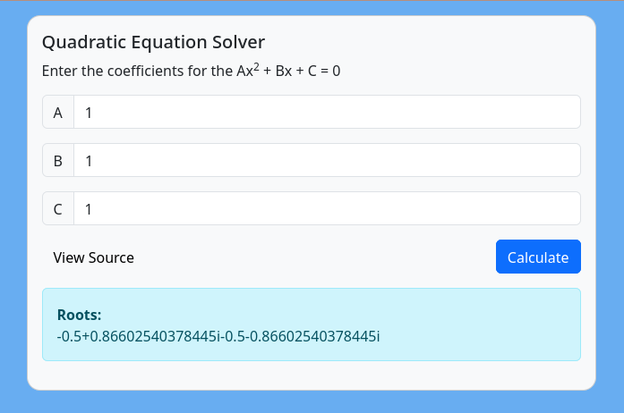

# FormulaWat
Who doesn't love a good spreadsheet? wat could go wrong...



# Files

- [index.php](html/index.php) - The original challenge
- [index_debug.php](html/index_debug.php) - The original challenge with extra debugging to make it more obvious what's happening with the formulas
- [index_debug.php](html/index_harder.php) - Harder version of the challenge
- [poc.html](html/poc.html) - My original PoC exploit, thanks to all those who have shared their solutions and shown me easier ways of doing it!

## Running

Should be pretty easy to get the app up and running if you have Docker installed already:
```bash
docker compose up -d --build
```

Then just hit the web server at http://localhost:9999

Alternatively you could run it outside a container, and just use `composer require phpoffice/phpspreadsheet` to install the 1 required library.